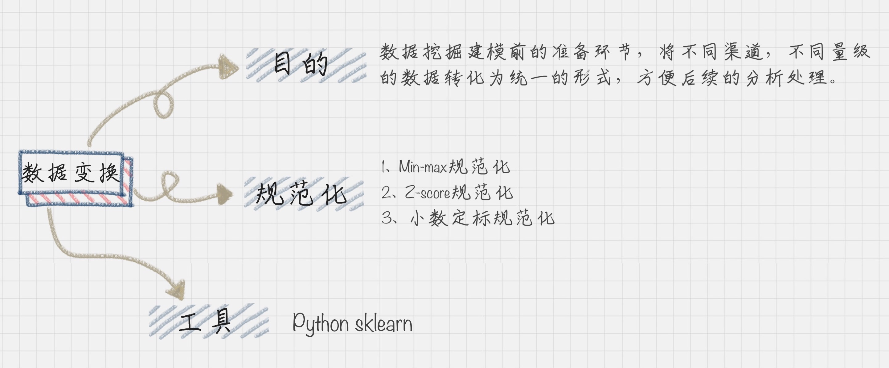

 数据分析的知识点

数据挖掘的核心：分类、聚类、预测、关联分析等

元数据：描述其他数据的数据，也称为中介数据

数据元：最小数据单元

Knowledge Discovery Database：数据预处理中对数据进行：数据清洗、数据集成、数据变换

用户是数据分析的出发点，用户画像建模步骤，给用户打标签也是用户消费行为分析，可以从用户标签、消费标签、行为标签、行为标签、内容分析4个维度进行标签划分。

.. figure:: ../images/12.jpg
按照数据流处理的阶段来划分用户画像建模的过程，可以分为数据层、算法层、业务层  

数据清洗的规则：“完全合一”
完整性：单条数据是否存在空值，统计的字段是否完善(对于缺失值：可以删除缺失的记录|使用当前列的均值|使用当前列出现频率最高的数据 对于空行，可以使用dropna()删除)
全面性：检查数据定义、单位标识、数值本身
合法性：数据的类型、内容、大小的合法性
唯一性：数据是否存在重复记录(一个列有多个参数，用split拆分|drop_duplicates()删除重复数据)  

数据集成的两种架构: ELT and ETL
Extract->Load->Transform  Extract->Transform->Load (Kettle Pentaho\DataX Ali)

Apache opensource software: Sqoop
Sqoop用来在Hadoop和关系型数据库中传递数据。通过Sqoop，可以方便的将数据从关系型数据库导入到HDFS或者将数据从HDFS导出到关系型数据库。

字段过滤－数据探索－相关性分析－建模筛选－数据变换（字段过滤－数据探索－相关性分析－建模筛选－数据变换（数据平滑，数据聚集，数据概化，规范化和属性构造等方式）
数据规范化的几种方法
1，Min－Max规范化
新数值 ＝ （原数值－极小值）/（极大值－极小值）
2，Z－Score规范化
新数值 ＝ （原数值 －均值）/标准差 （方差的算术平方根）
3. 小数定标规范化 通过移动小数点的位置来进行规范化

.. figure:: ../images/20.jpg

决策树会经历的两个阶段：构造（选择什么属性作为节点的过程：根节点、内部节点、叶节点）和剪枝(Pre-Pruning and Post-Pruning)
纯度（让目标变量的分歧最小）和信息熵entropy（信息的不确定度）
信息熵越大，纯度越低。当集合中所有的样本均匀混合时，信息熵越大，纯度越低。
构建决策树时，会基于纯度来构建。信息增益ID3算法、信息增益率C4.5算法以及基尼指数Cart算法。

