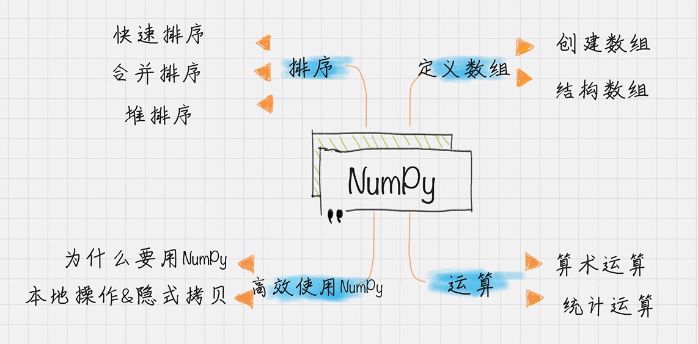
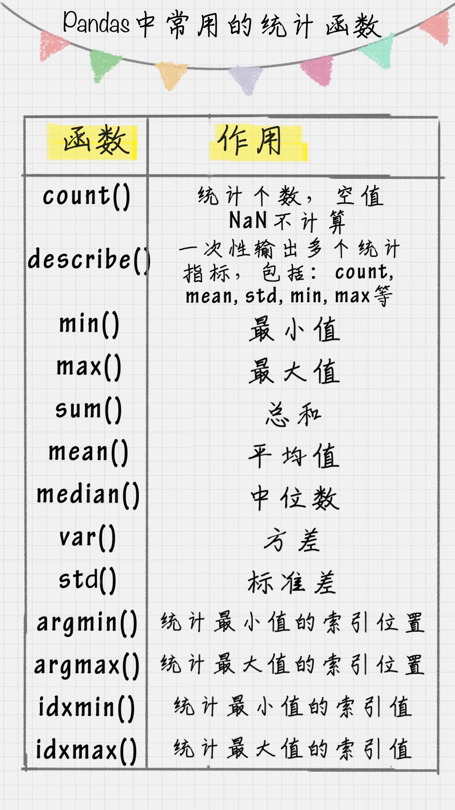
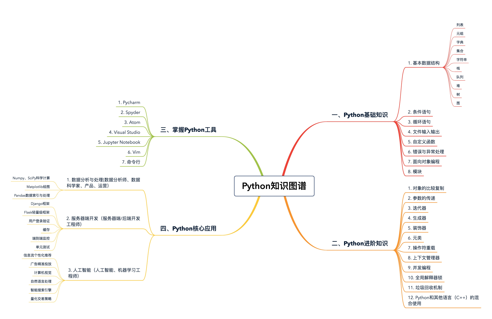

NumPy中数据结构是围绕ndarray展开的，数组存储在一个均匀连续的内存块中，缓存会直接把字节块从RAM加载到CPU寄存器中。数据连续的存储在内存中，NumPy直接利用现代CPU的矢量化指令计算，加载寄存器中的多个连续浮点数。另外NumPy中的矩阵计算可以采用多线程的方式，充分利用多核CPU计算资源，大大提升计算效率。 
axis=0是跨行(纵向) axis=1是跨列(横向)  

Pandas中的核心数据结构Series(定长的字典序列，相当于两个ndarray，含有index和values两个基本属性)和DataFrame(类似数据库表，包括行索引和列索引)  
在python里可以直接使用SQL语句来操作Pandas：pandasql

